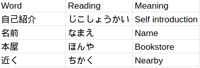

# Deck Helper

This is a simple command line script hat helps me make Anki decks while studying different languages, specifically Japanese.

When transcribing the meaning of a word or a kanji, etc from a textbook I found it clumsy to use the Anki app to make cards in bulk.
Using this I just have to make an excel/google sheets file, save it as a .csv and then run the script which is a *lot* more convenient. 

This makes some very pretty and easy to read, as well as information-dense flash cards that I have found very helpful to study with.

## Usage 
In the root directory, when you have a valid .csv. In your terminal of choice, type:

*Note: the Deck name must be the same as your target This may change but for simplicity's sake this is how it works right now.*
```bash 
# Assuming there is a .csv in the root directory called "target.csv"
ruby main.rb -c "target.csv" 
```
The .csv file can have many different layouts as the program does work around this, but here is one example of a file one might use: 

